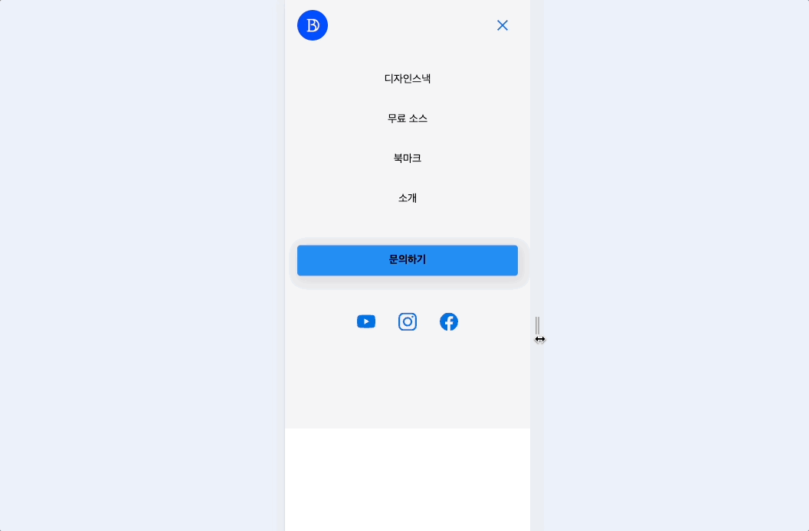
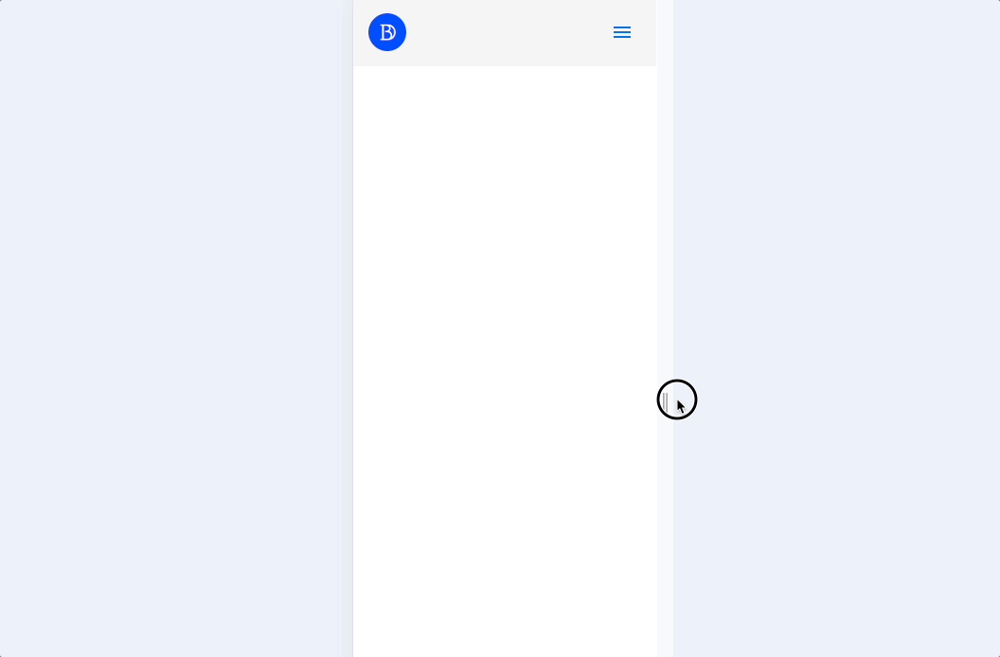
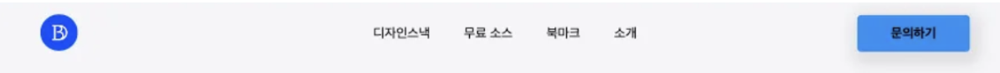
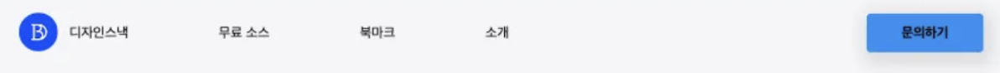
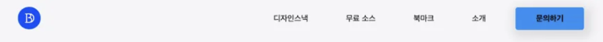
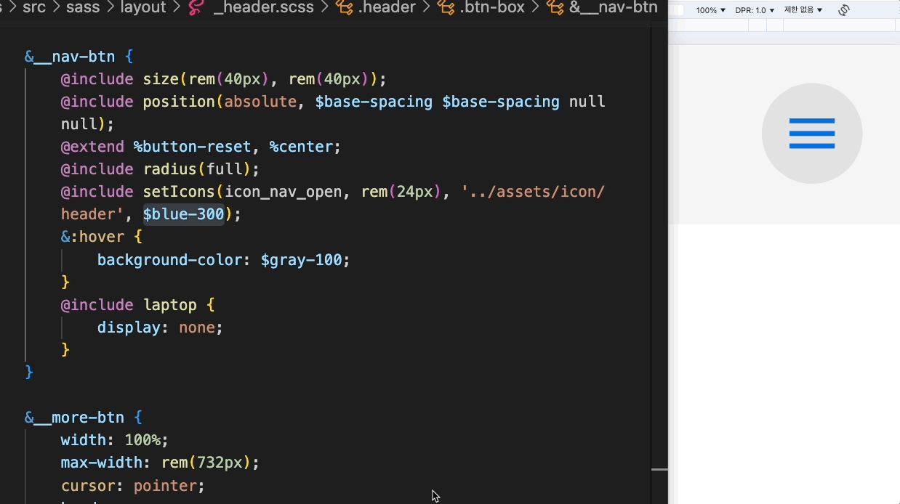

## 반응형 헤더 만들기
참고 강의01[💻 site](<https://youtu.be/X91jsJyZofw?si=A3cAyolVsX74OMmc>)
참고 강의02[💻 site](<https://youtu.be/1FhfdnrRbJc?si=IHVEomAzH3q1TOrq>)

## 목표

- 환경 세팅의 쓴맛보기(sass, live-server)
- 반응형 **Mobile First**
	- 모바일 퍼스트이기 때문에 min-width 사용
- .js 맛보기
- Sass
	- Sass의 문법 중  SCSS Syntax 를 사용
	- 다양한 Sass의 기법 중 @mixins 적극 활용
- 일관성 있는 표기법
	- 이미지 파일명 ex)icon_nav_close.svg
	- 클래스는명 ex)social-wrap, social-wrap__list

## 실행

```shell
npm install
npm start
```

## 사용

- html
- scss
- javascript

## 목차

- 기능 및 구현
- 어려웠던 점 & 학습한 내용

---

## 기능 및 구현

### 반응형
화면 사이즈 및 nav on/off여부에 따른 nav 메뉴
사이즈 변경에 따라 시각적으로 부드러운 UI를 제공하고자 하였습니다.
| nav on              | nav off               |
|---------------------|-----------------------|
|  |  |

### nav 레이아웃 
grid-template-colums으로 nav 정렬
| 1fr auto 1fr;       | auto 1fr 1fr;         | 1fr 1fr auto;         |
|---------------------|-----------------------|-----------------------|
| | | |

### 믹스인 아이콘 관련
*** svg 코드 👉 fill="current" & width, height제거 ***
css에서 svg color 바꾸기…의 여정
	- background-image대신에 mask-image사용
```
@include setIcons(이미지명, 가로세로사이즈, 이미지파일경로, 컬러);
```


### .js 메뉴
버튼 클릭 시 btn icon의 mask-image url 변경 + nav display: flex;
```
const btnNav = document.querySelector('#btnNav');
const navigation = document.querySelector('.navigation');
const navIcon = document.querySelector('.icon_nav_open');

btnNav.addEventListener('click', () => {
    // navigation 정적 변경
    navigation.classList.toggle('active');
    
    // navIcon 동적 변경
    if (navigation.classList.contains('active')) {
        navIcon.style.maskImage = 'url("../assets/icon/header/icon_nav_close.svg")';
        navIcon.style.webkitMaskImage = 'url("../assets/icon/header/icon_nav_close.svg")';
    } else {
        navIcon.style.maskImage = 'url("../assets/icon/header/icon_nav_open.svg")';
        navIcon.style.webkitMaskImage = 'url("../assets/icon/header/icon_nav_open.svg")';
    }
});
```

## 어려웠던 점 & 학습한 내용

### 👎 어려웠던 점
**1️⃣ 환경세팅**
 index.html 엔트리 파일 관련에 대한 이해와 그리고 작업을 어디서 해야하는지 감이 안잡혔습니다…(해결 못함)
**2️⃣ 파비콘**
현재까지 강력새로고침으로 해결해보려 하였지만 실패

### 👍 학습한 내용
**1️⃣ scss에 대한 학습**
아직 다양한 믹스인을 스스로 만드는 데에 한계가 있지만 만들어져 있는 믹스인을 내가 더 효율적으로 사용할 수 있도록 코드를 변경해볼 수 있었으며, 어떤 상황에서 쓰면 좋을지 고민할 수 있는 시간을 가질 수 있었다.
